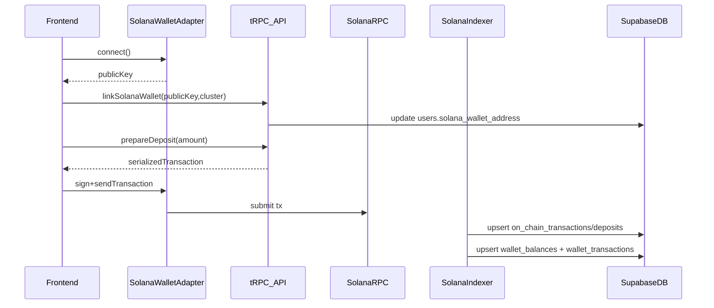

# Solana Wallet Adapter + Anchor Migration (devnet → mainnet)

## Goals

- **Keep app product behavior the same** (login via email/Telegram, VCOIN off-chain markets unchanged).
- **Replace WalletConnect/Wagmi/EVM** with **Solana Wallet Adapter** on the frontend.
- **Replace EVM contracts** with **Solana programs written in Anchor**.
- **Use a Solana indexing layer** for reconciliation (**Helius-first on devnet**; mainnet provider can be Helius or another Solana-native indexer/RPC+logs approach).
- **Remove EVM wallet fields from Supabase** and introduce **Solana-native fields**.

## Key findings from current code

- Wallet state is deeply EVM-specific in UI and backend:
  - Frontend links `users.wallet_address` + `users.chain_id` based on `wagmi` (`app/page.tsx`).
  - Backend prepares EVM calldata (`src/server/trpc/routers/wallet.ts`, `src/server/trpc/routers/market.ts`).
  - Webhook ingestion is EVM log decoding (`app/api/webhooks/alchemy/route.ts`).
- DB schema explicitly documents EVM semantics:
  - `users.wallet_address` is “Connected EVM wallet address” and `chain_id` is EVM chain id (`supabase/migrations/20260113000100_wallet_connect_fields.sql`).
  - `market_onchain_map` is keyed by `chain_id` and stores `vault_address` + EVM `bytes32` market id (`supabase/migrations/20260113000300_market_onchain_map_table.sql`).

## Migration approach (phased, minimal-risk)

### Phase A — Database: Solana wallet identity + Solana tx tracking

- Add a new Supabase migration that:
  - **Drops EVM wallet fields** from `public.users`:
    - drop columns `wallet_address`, `chain_id`, `wallet_connected_at`.
    - drop EVM-only indexes tied to `wallet_address`.
  - Adds Solana-native wallet fields:
    - `solana_wallet_address text` (base58 public key)
    - `solana_cluster text` (e.g. `devnet`, `mainnet-beta`)
    - `solana_wallet_connected_at timestamptz`
    - unique partial index on `solana_wallet_address` (one wallet per user)
  - Updates tx tracking tables to be Solana-compatible:
    - `on_chain_transactions`: replace `chain_id` with `solana_cluster`; replace `tx_hash` with `tx_sig` (Solana signature, base58), adjust unique index accordingly.
      - Treat `tx_sig` as **base58 string** (often up to ~88 chars). Uniqueness should be **(solana_cluster, tx_sig)**.
    - `deposits`: replace `chain_id` with `solana_cluster`; replace `tx_hash` with `tx_sig`; replace `from_address` with `from_pubkey` (base58).
  - Updates `market_onchain_map` to Solana semantics:
    - replace `chain_id` with `solana_cluster`
    - replace `vault_address` with `program_id`
    - replace `onchain_market_id` with a stable Solana identifier: `market_pda` (base58)
    - **Define PDA scheme (deterministic & collision-safe)**:
      - `market_pda = PDA(seeds=[b"market", market_uuid_bytes], program_id)`
      - where `market_uuid_bytes` is the 16 raw UUID bytes (not hex string), consistent across frontend/backend/indexer.
    - Consider adding `vault_pda` later if you introduce a per-market vault; MVP can use a single program-controlled vault PDA.
  - Token strategy (devnet-first → mainnet-later):
    - **Devnet**: create our own USDC-like SPL mint (6 decimals), so testers can reliably get funds.
    - **Mainnet-beta**: switch to official USDC mint by config/env.
    - **Design requirement**: treat the mint as **config/env**, not a hardcoded constant, and enforce it via Anchor constraints (program `Config` PDA).

**Files impacted**:

- [`supabase/migrations/`](supabase/migrations/) (new migration)
- [`src/types/database.ts`](src/types/database.ts) (regenerate/update types)
- [`supabase/DB_CONTEXT.md`](supabase/DB_CONTEXT.md) (refresh)

### Phase B — Frontend: replace WalletConnect/Wagmi with Solana Wallet Adapter

- Remove AppKit/Wagmi provider wiring and replace with:
  - `ConnectionProvider` + `WalletProvider` + `WalletModalProvider`
  - Wallet UI via `@solana/wallet-adapter-react-ui` (e.g. `WalletMultiButton`) or a styled wrapper.
- Replace all wagmi hooks usage (`useAccount`, `useWalletClient`, `useChainId`, `usePublicClient`) with Solana equivalents:
  - `useWallet()` for `publicKey`, `connected`, `signTransaction/sendTransaction/signMessage`
  - `useConnection()` for RPC connection
- Preserve the existing *flow*:
  - “Connect wallet” section still exists (but now shows base58 pubkey and Solana cluster)
  - On-chain USDC actions still require connected wallet

**Files impacted**:

- [`app/providers.tsx`](app/providers.tsx)
- [`lib/appKit.ts`](lib/appKit.ts) (removed)
- [`next.config.ts`](next.config.ts) (remove `transpilePackages` for Reown)
- [`app/page.tsx`](app/page.tsx)
- [`components/ProfilePage.tsx`](components/ProfilePage.tsx)
- [`components/MarketPage.tsx`](components/MarketPage.tsx)

### Phase C — Backend: Solana wallet linking + Solana tx preparation endpoints

- Update `user` router:
  - Replace `linkWallet/unlinkWallet/getWalletStatus/updateWalletChain` with Solana variants (or keep the names but change inputs/outputs):
    - input: `{ solanaWalletAddress: base58, solanaCluster: 'devnet'|'mainnet-beta' }`
    - enforce uniqueness on `solana_wallet_address`
- Replace EVM transaction-prep endpoints with Solana transaction-prep:
  - `wallet.prepareDeposit/prepareWithdraw` returns Solana instructions/serialized tx for SPL USDC deposit/withdraw.
  - `market.prepareBet/prepareSell/prepareClaim` returns Solana instructions/serialized tx for the Anchor program.

**Files impacted**:

- [`src/server/trpc/routers/user.ts`](src/server/trpc/routers/user.ts)
- [`src/server/trpc/routers/wallet.ts`](src/server/trpc/routers/wallet.ts)
- [`src/server/trpc/routers/market.ts`](src/server/trpc/routers/market.ts)

### Phase D — Anchor program: replace `PredictionMarketVault` contract

- Create an Anchor workspace with a program that mirrors today’s on-chain feature set:
  - deposit SPL USDC → credit user vault balance
  - withdraw → debit balance and transfer SPL USDC
  - placeBet/sellPosition → mutate positions and balances
  - claimWinnings → payout winning side
  - resolveMarket → admin resolution
- Preserve the “backend quote signer” pattern using Solana primitives:
  - **MVP (recommended)**: do **not** implement ed25519 quote verification initially. Instead:
    - Use **program-controlled PDAs** as authorities.
    - Enforce correctness via Anchor constraints + `Signer` checks (e.g., the user must sign; program derives PDAs deterministically; token accounts/mints must match configured USDC mint).
    - Keep off-chain pricing logic for UX, but avoid “off-chain quote integrity enforced on-chain” until after MVP.
  - **Later hardening (optional)**: add ed25519 quote verification if/when you need to prove the backend-approved quote was used on-chain.

**New files/directories**:

- `anchor/Anchor.toml`
- `anchor/programs/prediction_market_vault/` (Rust + IDL)
- `anchor/migrations/` / scripts
- `lib/solana/` (IDL client + helpers)

### Phase E — Solana indexing layer (Helius-first on devnet)

- Replace current EVM log-decoding webhook handler with a **Solana-native indexing layer**:
  - **Devnet**: plan around **Helius webhooks** (set up later) or a lightweight `connection.onLogs(programId, ...)` subscriber for local/dev iteration.
  - **Mainnet-beta**: choose whether to keep Helius or switch providers; keep ingestion code provider-agnostic.
  - Ingest program activity and reconcile into Supabase:
    - deposit/withdraw/bet/sell/claim → `on_chain_transactions`, `deposits`, `wallet_transactions`, `wallet_balances`
    - map “user pubkey” → `users.id` via `users.solana_wallet_address`
    - map “market PDA” → `markets.id` via `market_onchain_map` (`solana_cluster`, `market_pda`)
  - Keep webhook signature verification (HMAC) in place if the provider supplies it (Helius does; exact headers/payload to be confirmed during setup).
  - Mint awareness: indexer should treat the USDC mint as config/env (devnet custom mint vs mainnet official USDC).

**Files impacted**:

- (New) `app/api/webhooks/helius/route.ts` (or a server-side subscriber runner for local dev)

## Data flows (post-migration)

## Rollout strategy

- **Devnet first**:
  - configure `solana_cluster=devnet`
  - create a USDC-like SPL mint (6 decimals) and a mint-authority/faucet flow for testers
  - set USDC mint via env/config
- **Mainnet-beta next**:
  - same codepaths, switch env/config: `solana_cluster=mainnet-beta`, `program_id`, and USDC mint → official mainnet USDC

## Implementation todos

- Update Supabase schema: drop EVM wallet fields, add Solana wallet fields, convert tx tracking tables to Solana
- Replace frontend provider + hooks with Solana Wallet Adapter
- Update tRPC wallet-linking + tx-prep endpoints for Solana
- Add Anchor program + TS client + deployment scripts
- Implement Solana indexing layer (Helius-first on devnet) to reconcile DB