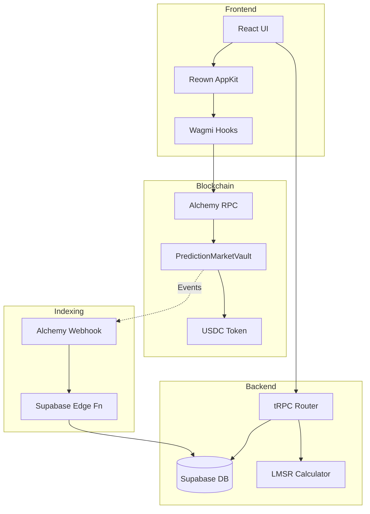

# WalletConnect Migration Plan

## Current State Analysis

**Existing Stack:**

- TypeScript/Bun/Next.js 15/tRPC/Supabase
- LMSR AMM with off-chain calculations (`place_bet_tx`, `sell_position_tx`)
- Virtual currency (VCOIN) with 6 decimals in `wallet_balances`
- Telegram-first auth with custom JWT
- Basic Reown AppKit setup in `lib/appKit.ts` (mainnet only, no Sepolia)
- `ProfilePage` has wallet connect/disconnect UI but no transaction signing

**Functions to Preserve:**

- Market creation, buying/selling shares, market resolution
- Comments, bookmarks, leaderboard, referrals
- Profile management, avatar uploads
- All tRPC endpoints in `market.ts` and `user.ts`

---

## Phase 1: Database Schema Updates

**File: New migration `supabase/migrations/YYYYMMDD_wallet_connect_fields.sql`**

Add to `users` table:

- `wallet_address` (text, nullable, unique) - Connected EVM wallet
- `chain_id` (integer, nullable) - Current chain (1 = Ethereum, 11155111 = Sepolia)
- `wallet_connected_at` (timestamp, nullable)

Add new tables:

- `on_chain_transactions` - Track pending/confirmed blockchain txs
  - `id`, `user_id`, `tx_hash`, `chain_id`, `status` (pending/confirmed/failed)
  - `tx_type` (deposit/bet/sell/claim), `amount_minor`, `market_id`
  - `created_at`, `confirmed_at`, `block_number`

- `deposits` - Track user deposits
  - `id`, `user_id`, `tx_hash`, `amount_minor`, `asset_code`, `status`
  - `created_at`, `confirmed_at`

---

## Phase 2: Smart Contract Development

**Directory: `contracts/` (new)**

**Contract 1: `PredictionMarketVault.sol`**

```solidity
// Core escrow vault for all user funds
- USDC/USDT ERC20 deposits
- marketId => resolved status mapping
- user => market => shares mapping (for settlement verification)
- deposit(), placeBet(), sellPosition(), claimWinnings()
- Ownable for admin pause/emergency functions
- Events: Deposited, BetPlaced, PositionSold, WinningsClaimed
```

**Contract 2: `MockUSDC.sol`** (testnet only)

- Simple ERC20 for Sepolia testing
- Faucet function for test tokens

**Tooling:**

- Hardhat/Foundry for compilation
- TypeChain for auto-generated TypeScript types
- Deploy scripts for Sepolia

**Contract addresses to store:**

- `NEXT_PUBLIC_VAULT_ADDRESS_SEPOLIA`
- `NEXT_PUBLIC_USDC_ADDRESS_SEPOLIA`

---

## Phase 3: AppKit Configuration Update

**File: [lib/appKit.ts](lib/appKit.ts)**

Current issues:

- Only mainnet networks configured
- No Sepolia testnet support
- No wagmi hooks exported for transactions

Updates needed:

```typescript
import { sepolia, mainnet } from '@reown/appkit/networks';

// Add Sepolia as default for testnet
const networks = [sepolia, mainnet, ...];

// Export wagmiConfig for transaction hooks
export const wagmiConfig = wagmiAdapter.wagmiConfig;

// Add autoConnect configuration
features: {
  analytics: false,
  email: false,
  socials: [],
}
```

---

## Phase 4: tRPC Backend Updates

**File: [src/server/trpc/routers/user.ts](src/server/trpc/routers/user.ts)**

New endpoints:

- `linkWallet` - Save wallet_address and chain_id after frontend connection
- `unlinkWallet` - Clear wallet_address on disconnect
- `getWalletStatus` - Check if wallet connected and balance

**File: [src/server/trpc/routers/market.ts](src/server/trpc/routers/market.ts)**

Modify existing flow:

```
Current: placeBet() -> Supabase RPC -> instant balance update
New:     placeBet() -> build tx -> return unsigned tx data
         -> frontend signs -> broadcasts -> webhook confirms -> Supabase update
```

New endpoints:

- `prepareBet` - Calculate LMSR price, return tx data to sign
- `prepareSell` - Calculate payout, return tx data to sign
- `prepareClaim` - Build claim tx for resolved market

**New file: `src/server/trpc/routers/wallet.ts`**

- `prepareDeposit` - Return vault address and approval tx data
- `prepareWithdraw` - Build withdrawal tx
- `getOnChainBalance` - Query USDC balance via RPC

---

## Phase 5: Alchemy Webhook Integration

**New file: `app/api/webhooks/alchemy/route.ts`**

Handle on-chain events:

- `Deposited` -> Credit `wallet_balances`
- `BetPlaced` -> Update `positions`, `trades`
- `PositionSold` -> Update `positions`, `wallet_balances`
- `WinningsClaimed` -> Mark position as claimed

Webhook security:

- Verify Alchemy signature
- Idempotency with `tx_hash` deduplication
- Atomic Supabase updates

---

## Phase 6: Frontend Transaction Flow

**File: [components/ProfilePage.tsx](components/ProfilePage.tsx)**

Enhance `WalletConnectSection`:

- Show USDC balance from on-chain query
- Network badge (Sepolia/Ethereum)
- View on Etherscan link
- Handle `chainChanged` events

**File: [components/MarketPage.tsx](components/MarketPage.tsx)**

Update bet flow:

1. Check `isConnected` from AppKit
2. If not connected: show "Connect Wallet First"
3. If connected: call `prepareBet` tRPC
4. Use wagmi `useSendTransaction` hook to sign
5. Show pending state until webhook confirms
```typescript
import { useSendTransaction, useWaitForTransaction } from 'wagmi';

const { sendTransaction, data: txHash } = useSendTransaction();
const { isLoading, isSuccess } = useWaitForTransaction({ hash: txHash });
```


**File: [components/WalletPage.tsx](components/WalletPage.tsx)**

Add deposit/withdraw UI:

- Token approval flow (ERC20 approve)
- Deposit amount input
- Withdraw to wallet button
- Transaction history with on-chain links

---

## Phase 7: Dual Currency Support (Transition Period)

During migration, support both:

- `VCOIN` (existing virtual) - for users without wallets
- `USDC` (real) - for connected wallets

**File: [db/functions/place_bet_tx.sql](db/functions/place_bet_tx.sql)**

Add conditional logic:

```sql
IF user_has_wallet AND asset = 'USDC' THEN
  -- Return tx data, don't deduct balance
  -- Balance updated via webhook
ELSE
  -- Keep existing VCOIN flow
END IF;
```

---

## Phase 8: Environment Configuration

**New env variables:**

```bash
# Alchemy
ALCHEMY_API_KEY=xxx
ALCHEMY_WEBHOOK_SECRET=xxx

# Contract addresses (Sepolia)
NEXT_PUBLIC_CHAIN_ID=11155111
NEXT_PUBLIC_VAULT_ADDRESS=0x...
NEXT_PUBLIC_USDC_ADDRESS=0x...

# WalletConnect (existing)
NEXT_PUBLIC_WALLETCONNECT_PROJECT_ID=xxx
```

---

## Architecture Diagram



---

## 

---

## Risk Mitigations

- **Session persistence:** AppKit handles localStorage encryption
- **Network detection:** Auto-switch prompts for wrong chain
- **Transaction failures:** Retry logic with nonce management
- **Webhook reliability:** Idempotent handlers, dead letter queue
- **Security:** No private keys on backend, non-custodial design

---

## Files to Create/Modify Summary

**New Files:**

- `contracts/PredictionMarketVault.sol`
- `contracts/MockUSDC.sol`
- `app/api/webhooks/alchemy/route.ts`
- `src/server/trpc/routers/wallet.ts`
- `supabase/migrations/YYYYMMDD_wallet_connect_fields.sql`

**Modified Files:**

- `lib/appKit.ts` - Add Sepolia, export config
- `src/server/trpc/routers/user.ts` - Wallet linking
- `src/server/trpc/routers/market.ts` - Prepare tx endpoints
- `components/ProfilePage.tsx` - Enhanced wallet UI
- `components/MarketPage.tsx` - Transaction signing
- `components/WalletPage.tsx` - Deposit/withdraw
- `db/functions/place_bet_tx.sql` - Dual currency support