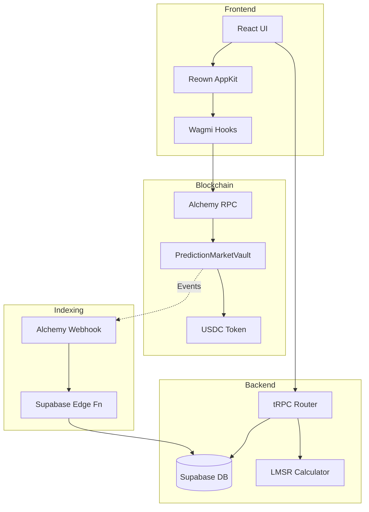

---

name: WalletConnect Migration Plan

overview: Migrate from virtual currency (VCOIN) to real USDC/USDT with a **local-first Hardhat workflow**, then deploy to **Polygon Amoy testnet** using Reown AppKit for wallet integration and Solidity smart contracts for on-chain escrow, while preserving all existing functionality.

overview: Migrate from virtual currency (VCOIN) to real USDC/USDT with a **local Hardhat-first workflow**, while preserving all existing functionality. Testnet and mainnet are explicitly deferred until local flows are stable.

todos:

  - id: local-hardhat-first

content: Run local workflow (Hardhat node + local deploy + quoteSigner configured) and validate end-to-end flows

status: completed

  - id: db-schema

content: Create Supabase migration for wallet_address, chain_id, on_chain_transactions, deposits tables

status: completed

  - id: smart-contracts

content: Develop PredictionMarketVault.sol and MockUSDC.sol with Hardhat, validate locally

status: completed

  - id: eip712-quote-signer

content: Require backend-authorized EIP-712 quote signatures for bet/sell (secure non-custodial quoting)

status: completed

  - id: market-onchain-map

content: Add multi-chain market_onchain_map table to reconcile Supabase UUID markets with on-chain bytes32 IDs

status: completed

  - id: appkit-config

content: Update lib/appKit.ts with Sepolia network, export wagmiConfig, configure autoConnect

status: completed

  - id: wallet-trpc

content: Create wallet.ts tRPC router with linkWallet, unlinkWallet, prepareDeposit, prepareWithdraw

status: completed

  - id: market-tx-endpoints

content: Add prepareBet, prepareSell, prepareClaim endpoints to market.ts router

status: completed

  - id: alchemy-webhook

content: Create /api/webhooks/alchemy route to handle on-chain events and sync Supabase

status: completed

  - id: profile-wallet-ui

content: Enhance ProfilePage WalletConnectSection with balance display, network badge, Etherscan link

status: pending

  - id: market-signing

content: Update MarketPage bet flow to use wagmi useSendTransaction for on-chain signing

status: pending

  - id: wallet-page-deposit

content: Add deposit/withdraw UI to WalletPage with ERC20 approval flow

status: pending

  - id: dual-currency

content: Modify place_bet_tx SQL to support dual VCOIN/USDC paths during transition

status: pending

---

# WalletConnect Migration Plan

## Current State Analysis

**Existing Stack:**

- TypeScript/Bun/Next.js 15/tRPC/Supabase
- LMSR AMM with off-chain calculations (`place_bet_tx`, `sell_position_tx`)
- Virtual currency (VCOIN) with 6 decimals in `wallet_balances`
- Telegram-first auth with custom JWT
- Reown AppKit configured for **local Hardhat (31337)** during development/testing
- `ProfilePage` has wallet connect/disconnect UI but no transaction signing

**Functions to Preserve:**

- Market creation, buying/selling shares, market resolution
- Comments, bookmarks, leaderboard, referrals
- Profile management, avatar uploads
- All tRPC endpoints in `market.ts` and `user.ts`

---

## Development Workflow: Local Hardhat First (then testnet, then mainnet)

We will **test everything locally on Hardhat** before moving to any testnet, and only then mainnet:

- **Local (Hardhat)**:
  - Focus: contract logic, EIP-712 quote signing flow, event decoding, and DB sync logic (without real money / real networks)
  - Commands:
    - `bun run contracts:node` (starts local RPC at `127.0.0.1:8545`)
    - If you see `EADDRINUSE 127.0.0.1:8545`: run `bun run contracts:node:kill` then start node again
    - `bun run contracts:deploy:local` (deploys MockUSDC + Vault and **sets `quoteSigner`** automatically)
  - Notes:
    - Because `package.json` has `"type": "module"`, Hardhat scripts that use CommonJS must be `.cjs`

- **Testnet (later)**:
  - Only after local flows are stable
  - Requires funded deployer wallet + RPC + webhook/indexer strategy

- **Mainnet (much later)**:
  - Only after testnet soak + audits + monitoring

Hardhat warning:

- Hardhat may warn on Node.js versions outside its supported range. Prefer **Node 20 LTS** for reliability.

---

## Phase 1: Database Schema Updates

**File: New migration `supabase/migrations/YYYYMMDD_wallet_connect_fields.sql`**

Add to `users` table:

- `wallet_address` (text, nullable, unique) - Connected EVM wallet
- `chain_id` (integer, nullable) - Current chain (1 = Ethereum, 11155111 = Sepolia)
- `wallet_connected_at` (timestamp, nullable)

Add new tables:

- `on_chain_transactions` - Track pending/confirmed blockchain txs
  - `id`, `user_id`, `tx_hash`, `chain_id`, `status` (pending/confirmed/failed)
  - `tx_type` (deposit/bet/sell/claim), `amount_minor`, `market_id`
  - `created_at`, `confirmed_at`, `block_number`

- `deposits` - Track user deposits
  - `id`, `user_id`, `tx_hash`, `amount_minor`, `asset_code`, `status`
  - `created_at`, `confirmed_at`

---

## Phase 2: Smart Contract Development

**Directory: `contracts/` (new)**

**Contract 1: `PredictionMarketVault.sol`**

```solidity
// Core escrow vault for all user funds
- USDC/USDT ERC20 deposits
- marketId => resolved status mapping
- user => market => shares mapping (for settlement verification)
- deposit(), placeBet(), sellPosition(), claimWinnings()
- Ownable for admin pause/emergency functions
- Events: Deposited, BetPlaced, PositionSold, WinningsClaimed
```

**Contract 2: `MockUSDC.sol`** (dev + testnet)

- Simple ERC20 for local and testnet testing (6 decimals)
- Faucet function for test tokens

**Tooling:**

- Hardhat/Foundry for compilation
- TypeChain for auto-generated TypeScript types
- Deploy scripts for local, and Polygon Amoy

**Contract addresses to store:**

- Local (Hardhat):
  - `NEXT_PUBLIC_VAULT_ADDRESS_LOCAL`
  - `NEXT_PUBLIC_USDC_ADDRESS_LOCAL`
- Polygon Amoy:
  - `NEXT_PUBLIC_VAULT_ADDRESS_AMOY`
  - `NEXT_PUBLIC_USDC_ADDRESS_AMOY`

---

## Phase 3: AppKit Configuration Update

**File: [lib/appKit.ts](lib/appKit.ts)**

Current issues:

- Missing local Hardhat + Polygon Amoy network configuration
- No wagmi hooks exported for transactions

Updates needed:

```typescript
import { polygonAmoy } from 'viem/chains';

const hardhatLocal = {
  id: 31337,
  name: 'Hardhat (Local)',
  rpcUrls: { default: { http: ['http://127.0.0.1:8545'] } },
  testnet: true,
};

const networks = [hardhatLocal, polygonAmoy];

// Export wagmiConfig for transaction hooks
export const wagmiConfig = wagmiAdapter.wagmiConfig;

// Add autoConnect configuration
features: {
  analytics: false,
  email: false,
  socials: [],
}
```

---

## Phase 4: tRPC Backend Updates

**File: [src/server/trpc/routers/user.ts](src/server/trpc/routers/user.ts)**

New endpoints:

- `linkWallet` - Save wallet_address and chain_id after frontend connection
- `unlinkWallet` - Clear wallet_address on disconnect
- `getWalletStatus` - Check if wallet connected and balance

**File: [src/server/trpc/routers/market.ts](src/server/trpc/routers/market.ts)**

Modify existing flow:

```
Current: placeBet() -> Supabase RPC -> instant balance update
New:     placeBet() -> build tx -> return unsigned tx data
         -> frontend signs -> broadcasts -> webhook confirms -> Supabase update
```

New endpoints:

- `prepareBet` - Calculate LMSR price, return tx data to sign
- `prepareSell` - Calculate payout, return tx data to sign
- `prepareClaim` - Build claim tx for resolved market

**New file: `src/server/trpc/routers/wallet.ts`**

- `prepareDeposit` - Return vault address and approval tx data
- `prepareWithdraw` - Build withdrawal tx
- `getOnChainBalance` - Query USDC balance via RPC

---

## Phase 5: Alchemy Webhook Integration

**New file: `app/api/webhooks/alchemy/route.ts`**

Handle on-chain events:

- `Deposited` -> Credit `wallet_balances`
- `BetPlaced` -> Update `positions`, `trades`
- `PositionSold` -> Update `positions`, `wallet_balances`
- `WinningsClaimed` -> Mark position as claimed

Webhook security:

- Verify Alchemy signature
- Idempotency with `tx_hash` deduplication
- Atomic Supabase updates

---

## Phase 6: Frontend Transaction Flow

**File: [components/ProfilePage.tsx](components/ProfilePage.tsx)**

Enhance `WalletConnectSection`:

- Show USDC wallet balance + Vault balance (on-chain reads)
- Network badge (Hardhat local / Polygon Amoy)
- Deposit/Withdraw UI (approve + deposit, withdraw)
- Keep DB wallet link in sync with connected wallet (address + chainId)

**File: [components/MarketPage.tsx](components/MarketPage.tsx)**

Update bet flow:

1. If market settlement asset is `VCOIN`: keep existing flow (RPC -> DB tx)
2. If market settlement asset is `USDC/USDT`:

   - Ensure wallet is connected and linked in DB (`user.linkWallet`)
   - Call `market.prepareBet` to get calldata + EIP-712 quote signature
   - Send tx via wagmi (wallet signs)
   - Locally (Hardhat): show tx success + read contract state for balances/positions
   - On testnet (Amoy): show tx pending until webhook/indexer confirms and DB updates
```typescript
import { useWalletClient, usePublicClient } from 'wagmi';

const { data: walletClient } = useWalletClient();
const publicClient = usePublicClient();
const txHash = await walletClient.sendTransaction({ to, data, value });
await publicClient.waitForTransactionReceipt({ hash: txHash });
```


**File: [components/WalletPage.tsx](components/WalletPage.tsx)**

Add deposit/withdraw UI:

- Token approval flow (ERC20 approve)
- Deposit amount input
- Withdraw to wallet button
- Transaction history with on-chain links

---

## Phase 7: Dual Currency Support (Transition Period)

During migration, support both:

- `VCOIN` (existing virtual) - for users without wallets
- `USDC` (real) - for connected wallets

Implementation rule:

- A market’s `settlement_asset_code` determines its mode:
  - `VCOIN` → keep existing SQL/RPC flows (`place_bet_tx`, `sell_position_tx`)
  - `USDC/USDT` → use on-chain prepare+sign flows (`prepareBet`, `prepareSell`, `prepareClaim`)

**File: [db/functions/place_bet_tx.sql](db/functions/place_bet_tx.sql)**

Add conditional logic:

```sql
IF user_has_wallet AND asset = 'USDC' THEN
  -- Return tx data, don't deduct balance
  -- Balance updated via webhook
ELSE
  -- Keep existing VCOIN flow
END IF;
```

---

## Phase 8: Environment Configuration (Local now; testnet/mainnet later)

**New env variables:**

```bash
# Local Hardhat
LOCAL_RPC_URL=http://127.0.0.1:8545

# Testnet (deferred)
# ALCHEMY_API_KEY=xxx
# ALCHEMY_WEBHOOK_SECRET=xxx

# Backend quote signing (EIP-712)
# NOTE: This is a real private key stored on the backend. Protect it (never expose to client, never commit).
QUOTE_SIGNER_PRIVATE_KEY=0x...

# Contract addresses (Local)
NEXT_PUBLIC_CHAIN_ID=31337
NEXT_PUBLIC_VAULT_ADDRESS_LOCAL=0x...
NEXT_PUBLIC_USDC_ADDRESS_LOCAL=0x...

# WalletConnect (existing)
NEXT_PUBLIC_WALLETCONNECT_PROJECT_ID=xxx
```

**Local-only env (optional helpers):**

```bash
# Local Hardhat (31337) helpers (not used by production)
NEXT_PUBLIC_CHAIN_ID=31337
NEXT_PUBLIC_VAULT_ADDRESS_LOCAL=0x...
NEXT_PUBLIC_USDC_ADDRESS_LOCAL=0x...
```

---

## Architecture Diagram



---

## 

---

## Risk Mitigations

- **Session persistence:** AppKit handles localStorage encryption
- **Network detection:** Auto-switch prompts for wrong chain
- **Transaction failures:** Retry logic with nonce management
- **Webhook reliability:** Idempotent handlers, dead letter queue
- **Security:** Funds are non-custodial (users sign txs), but backend holds a **quote signer private key** for EIP-712 authorized quotes. Protect with secret management (KMS/Secret Manager), rotate keys, and scope permissions. Never expose to clients.

---

## Files to Create/Modify Summary

**New Files:**

- `contracts/PredictionMarketVault.sol`
- `contracts/MockUSDC.sol`
- `app/api/webhooks/alchemy/route.ts`
- `src/server/trpc/routers/wallet.ts`
- `supabase/migrations/YYYYMMDD_wallet_connect_fields.sql`

**Modified Files:**

- `lib/appKit.ts` - Add Hardhat local + Polygon Amoy, export config
- `src/server/trpc/routers/user.ts` - Wallet linking
- `src/server/trpc/routers/market.ts` - Prepare tx endpoints
- `components/ProfilePage.tsx` - Enhanced wallet UI
- `components/MarketPage.tsx` - Transaction signing
- `components/WalletPage.tsx` - Deposit/withdraw
- `db/functions/place_bet_tx.sql` - Dual currency support